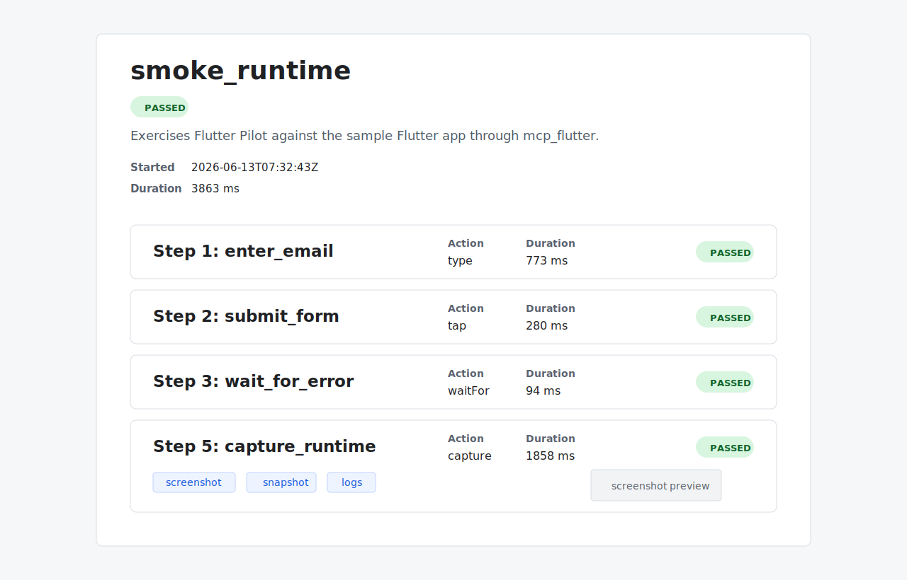

# Flutter Pilot

[中文](README_zh.md)

Flutter Pilot turns Flutter UI journeys into reproducible, AI-readable
debugging context.

It lets you describe a UI path in YAML, replay that Scenario against a running
Flutter app, and collect the context needed to understand what happened:
actions, screenshots, semantic Snapshots, logs, run reports, and timeline
views. The goal is to make a UI bug report readable by humans, CI, and AI
coding agents without relying on vague manual reproduction notes.

Flutter Pilot builds above `mcp_flutter`, which provides the Flutter runtime
bridge for interaction and inspection. Thanks to the `mcp_flutter` project for
making Flutter UI state and runtime operations available through a toolable
interface.

## What It Does

Flutter Pilot treats a UI journey as a portable Scenario. A Scenario says which
widgets to tap, where to type, what to wait for, when to scroll, and where to
capture diagnostic artifacts.

Scenario metadata can also request full-run device video recording with
`scenario.recording`. Recording is run-level context: it starts before the first
Step, stops during run shutdown, and is reported as a Device Video Recording
artifact rather than a Step artifact.

Runtime connection details are not stored in YAML. The same Scenario can be
validated, shared, committed, and replayed against different Runtime Targets by
passing target details through the CLI.

The resulting run directory is intended to be useful on its own: a developer can
inspect it visually, CI can archive it, and an AI agent can read its structured
artifacts as compact context for debugging.

## Why It Exists

Flutter UI bugs are hard to hand off when the report only contains a screenshot
and a loose sequence of steps. Screenshots show appearance, but they do not
explain the structured UI state, recent actions, logs, or exact checkpoint where
the issue appeared.

Flutter Pilot creates a repeatable UI journey and captures the surrounding
runtime context so a person or agent can answer sharper questions:

- What did the user do before the failure?
- Which visible text and semantic UI elements were present?
- Which logs or runtime errors happened near the failing Step?
- Did the before and after runs change the intended UI state?

## Quick Example

```yaml
scenario:
  name: login_error
  description: Reproduce the invalid login message.
  recording: {}

steps:
  - label: enter_email
    type:
      byType: textField
      text: bad@example.com

  - label: submit_login
    tap:
      byText: Continue
      byType: button

  - label: error_visible
    waitFor:
      byText: Invalid email or password
      timeoutMs: 5000

  - label: capture_failure
    capture: {}
```

This Scenario describes the UI journey only. Flutter Pilot launches the Target
App Package through the `test` command and derives the Runtime Target from
Flutter's machine output.

`recording: {}` enables default Scenario Recording. Omit `recording` for no
recording, or use `recording.enabled: false` to disable it explicitly.
Boolean shorthand such as `recording: true` is invalid.

The HTML timeline report turns the same journey into a visual review surface:



## Usage

Install the Flutter Pilot CLI in the workspace that owns your Scenarios:

```bash
dart pub add --dev flutter_pilot
```

Flutter Pilot drives a Flutter app through `mcp_flutter`. The target app must
expose the MCP Toolkit runtime extension before `flutter_pilot test` can
interact with it.

In the Flutter app package, add the runtime dependency:

```bash
flutter pub add mcp_toolkit
```

Then bootstrap the app through `MCPToolkitBinding`:

```dart
import 'package:flutter/material.dart';
import 'package:mcp_toolkit/mcp_toolkit.dart';

Future<void> main() async {
  await MCPToolkitBinding.instance.bootstrapFlutter(
    runApp: () => runApp(const MyApp()),
  );
}
```

Run `flutter_pilot test` from the Flutter app package. Flutter Pilot launches
the app with `flutter run --machine`, reads the Runtime Target URI from Flutter,
runs the Scenario, and stops the launched app during cleanup.

Check app-side Flutter Pilot setup from the Flutter app package:

```bash
dart run flutter_pilot doctor
```

Initialize the safe dependency setup from the Flutter app package:

```bash
dart run flutter_pilot init
```

`init` runs `flutter pub add mcp_toolkit` when the runtime dependency is
missing. It does not edit `lib/main.dart`; when `bootstrapFlutter` is missing,
it prints the import and `runApp` wrapper to add manually.

Validate a Scenario without connecting to a Flutter app:

```bash
dart run flutter_pilot validate examples/smoke_scenario.yaml
```

Run a Scenario by launching the current Target App Package:

```bash
dart run flutter_pilot test examples/smoke_scenario.yaml
```

Select the Target Device, Flutter flavor, or app entrypoint when needed:

```bash
dart run flutter_pilot test examples/smoke_scenario.yaml \
  --device <device-id-or-name> \
  --flavor staging \
  --target lib/main_staging.dart
```

Stop after a specific Step and print captured diagnostic context:

```bash
dart run flutter_pilot test examples/smoke_scenario.yaml \
  --until wait_for_error \
  --print snapshot
```

Regenerate the HTML timeline from an existing run directory:

```bash
dart run flutter_pilot report .runs/<run-directory>
```

Compare two existing run directories:

```bash
dart run flutter_pilot diff .runs/<before-run> .runs/<after-run>
dart run flutter_pilot diff .runs/<before-run> .runs/<after-run> --json
```

## Scenario YAML

Scenario YAML is Flutter Pilot's portable description of a UI journey. It
supports ordered Steps, Step labels, Step Includes for shared Step Libraries,
Finders, actions, waits, scrolling, and capture checkpoints.

See [docs/scenario-yaml.md](docs/scenario-yaml.md) for the full syntax,
examples, and validation rules.

## Commands

```bash
flutter_pilot validate <scenario.yaml>
flutter_pilot validate <scenario.yaml> --json
flutter_pilot doctor
flutter_pilot init
flutter_pilot test <scenario.yaml>
flutter_pilot test <scenario.yaml> --device <device-id-or-name>
flutter_pilot test <scenario.yaml> --flavor <flavor> --target <entrypoint.dart>
flutter_pilot test <scenario.yaml> --until <step-or-label>
flutter_pilot test <scenario.yaml> --until <step-or-label> --print <snapshot|widget-tree|errors>
flutter_pilot report <run-directory>
flutter_pilot diff <before-run> <after-run>
flutter_pilot diff <before-run> <after-run> --json
```

`--print` may be repeated. When several diagnostics are requested, Flutter Pilot
prints them in a stable order: Snapshot, Widget Tree, then errors.

`run` is no longer a Flutter Pilot command. `test --target` follows Flutter CLI
vocabulary and selects the app entrypoint file; it does not accept a VM service
URI.

When `scenario.recording` is enabled, Flutter Pilot records the resolved Target
Device. The Target Device must also be available as a Recording Device with the
same device id. If `--device` is omitted, Flutter Pilot auto-selects only when
exactly one supported Flutter Device id is also recordable.

## Artifacts

A Scenario run writes a run directory under `.runs/`. The artifact model is
designed for both human review and machine consumption.

- Screenshot: what a user saw on screen.
- Snapshot: structured UI state for tools and AI agents.
- Widget Tree: deeper Flutter hierarchy data when requested.
- Logs: runtime and diagnostic output.
- Device Video Recording: optional run-level video saved when
  `scenario.recording` is enabled, stored as
  `artifacts/device-video-recording.<ext>`.
- `run_report.json`: machine-readable execution summary.
- `timeline.html`: visual timeline generated from run artifacts.

## Development

```bash
dart format .
dart analyze
dart test
```

Add Dart dependencies with `dart pub add` so dependency metadata stays
consistent.

## Documentation

- [CONTEXT.md](CONTEXT.md): project vocabulary.
- [docs/scenario-yaml.md](docs/scenario-yaml.md): Scenario YAML syntax.
- [docs/run-diff.md](docs/run-diff.md): Run Diff command, output, outcomes,
  Regression rules, and acceptance fixtures.
- [docs/flutter-pilot-prd.md](docs/flutter-pilot-prd.md): product scope and
  implementation decisions.
- [docs/cli-step-progress-prd.md](docs/cli-step-progress-prd.md): CLI Step
  progress feature requirements and implementation decisions.
- [docs/adr/0001-use-dart-cli-with-yaml-scenario-dsl.md](docs/adr/0001-use-dart-cli-with-yaml-scenario-dsl.md):
  architecture decision for the Dart CLI and YAML Scenario DSL.

## Scope

Flutter Pilot focuses on reproducible Flutter UI debugging artifacts. It does
not replace `mcp_flutter`, and it is not trying to become a broad visual
regression platform in the first version.
